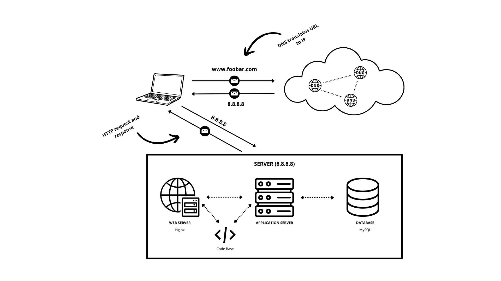

# 
Web Infrastructure Design

## Description of the infrastructure

### Server

The server is a physical or virtual machine, generally located in a data center, that hosts the entire web infrastructure.
It runs the necessary software and services to serve the website.

The server communicates with other devices, such as a user's computer, over a network to fulfill requests. This communication follows the principles of the TCP/IP protocol suite.

A server, like any other computer, requires an operating system to function effectively. Common server operating systems include Linux distributions (e.g., Ubuntu Server, CentOS) and Windows Server.

**Linux Server OS:**
Widely used for web servers, database servers, and other server applications.
Known for stability, security, and open-source flexibility.

**Windows Server OS:**
Developed by Microsoft, often used in enterprise environments.
Provides compatibility with Microsoft technologies and services.

### Domain Name and DNS Record

The domain name (foobar.com) is the human-readable address used to identify the website.
The www record configured for the domain points to the server's IP address (8.8.8.8).
DNS record for www:

The DNS record for www in www.foobar.com is a CNAME (Canonical Name) record.
It is used to alias or map the www subdomain to the root domain (foobar.com).

### Web Server (Nginx)

The web server (Nginx) receives incoming HTTP requests from the user's browser.
It listens on port 80 and handles the initial processing of the request.
It retrieves the requested resources and sends the response back to the user's browser.
A web server’s role is to serve web pages (static content).

### Application Server

The application server runs the code base of the website.
It processes dynamic content, executes server-side code, and interacts with the database.
It communicates with the web server to generate the appropriate response.
The application files contain the source code and related files of the website.
They include HTML, CSS, JavaScript, server-side scripts, and any other necessary files.

### Database (MySQL)

The database (MySQL) stores and manages the website's data.
It is used to persist and retrieve information for dynamic content.
The application server communicates with the database to perform data operations.

### Server-User Communication
The server communicates with the user's computer over the Internet using the HTTP protocol.
When the user requests a webpage, the server responds by sending the requested content back to the user's browser.

## Potential infrastructure problems.

- **Single Point of Failure (SPOF)**: Since this infrastructure consists of a single server, if the server fails or goes down, the entire website becomes inaccessible because nothing is redundant.

- **Downtime during Maintenance**: During maintenance activities, such as deploying new code, the web server needs to be restarted, resulting in downtime or temporary unavailability of the website.

- **Unable to Handle Increased Traffic**: With only one server, it may not be able to handle a significant increase in incoming traffic. This could lead to performance issues or downtime if the traffic exceeds the server's capacity.