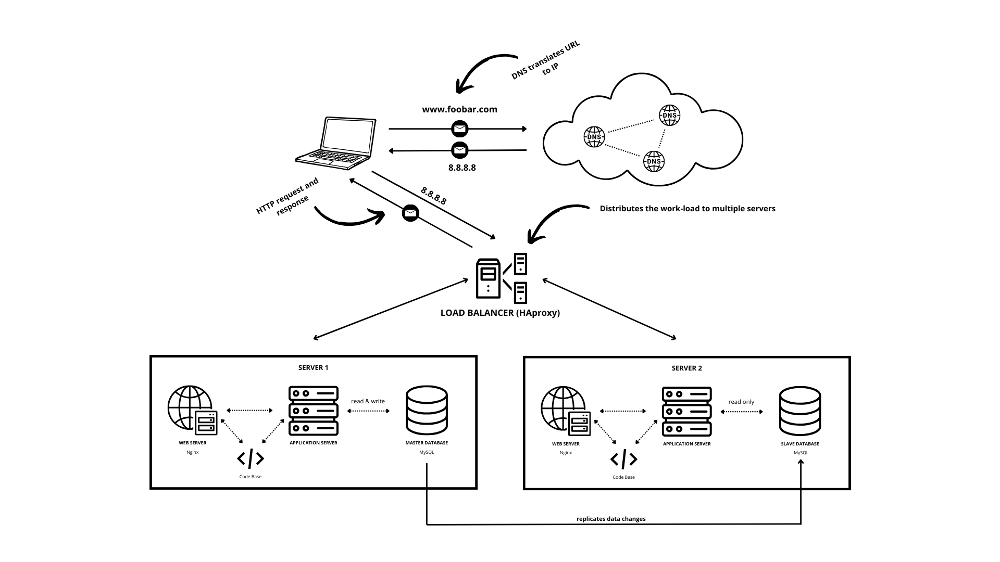

# 
Distributed Web Infrastructure

## Description of the infrastructure
  
### Servers

Two servers are added to distribute the workload and provide redundancy.
They share the load of handling incoming requests, enhancing performance and reliability.

### Web server (Nginx)

The web server (Nginx) receives incoming HTTP requests from the user's browser.
It listens on port 80 and handles the initial processing of the request.
It retrieves the requested resources and sends the response back to the user's browser.

### Application server.

The application server runs the code base of the website.
It processes dynamic content, executes server-side code, and interacts with the database.
It communicates with the web server to generate the appropriate response.

### Load splitter (HAproxy)

The load balancer (HAproxy) sits between the user and the web/application servers.
It distributes incoming requests across multiple servers using a specific distribution algorithm.
It helps in load distribution, improving performance and scalability.

### Database (MySQL)

The database (MySQL) stores and manages the website's data.
It is used to persist and retrieve information for dynamic content.
The application server communicates with the database to perform data operations.

## Specificities of the infrastructure
  
**Load Balancer (HAProxy):**

The load balancer ensures even distribution of incoming traffic among the web servers.
Round Robin algorithm is chosen for simplicity and uniform distribution of requests.
Active-Active setup: Both web servers are active and share the load. If one fails, the other continues to serve requests.

**Primary-Replica database cluster:**
The database cluster is configured using the Primary-Replica (Master-Slave) model. The primary node (master) manages write operations, while replicated nodes (slaves) manage read operations. The data is replicated asynchronously from the primary node to the replicated nodes to ensure data consistency and better availability.

**Difference between the primary node and the replicated node:**
The primary node is responsible for writing and updating the database. It is used by the application for write requests. The replicated nodes are used for read operations and serve as a backup in the event of a failure of the primary node. They guarantee high availability and improve performance by distributing read operations between replicated nodes.
  

## Potential infrastructure problems.
  
### Single point of failure (SPOF):

- Each component of the infrastructure can become a single point of failure. In the event of a server, load balancer or database failure, this may lead to a service interruption or unavailability of the website.

### Security issues:

- The current infrastructure does not include firewalls, which makes it vulnerable to attacks and intrusions. It is recommended to add a firewall to control network traffic and protect servers from potential threats.

- The absence of HTTPS (secure HTTP) exposes communications between users and the web server to the risk of data breach. The implementation of HTTPS is essential to secure exchanges and protect data confidentiality.

### Lack of supervision:

- The infrastructure does not have a monitoring system in place. It is recommended to implement a monitoring system to monitor performance, detect problems and failures, and take preventive or corrective measures.