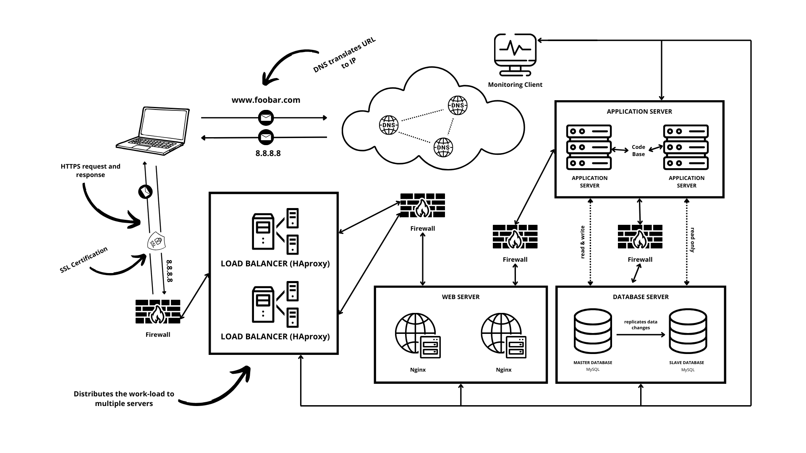

# 
Scaled Secured And Monitored Web Infrastructure

## Description of the Infrastructure

The infrastructure includes the following components:

### One more Server
We add an additional server to enhance the reliability and performance of the infrastructure. With multiple servers, we can distribute the workload and provide redundancy, reducing the risk of a single point of failure.

### One more Load Balancer (HAproxy)
The load balancer is added to distribute incoming requests across multiple servers. By configuring HAproxy as a cluster, we ensure high availability and improve the scalability of the infrastructure.

### Splited Components (Web Server, Application Server, Database)
We separate the components of the infrastructure onto their dedicated servers:
- Web Server: The web server is responsible for handling HTTP requests and serving static content, such as HTML, CSS, and images.
- Application Server: The application server executes the application logic, processes dynamic content, and generates responses to client requests.
- Database: The database server stores and manages the application's data.

## Specificities of the Infrastructure

- Server: The additional server enhances the infrastructure's reliability and fault tolerance by distributing the workload and providing redundancy. It allows for better resource utilization and improved performance.
- Load Balancer (HAproxy): The load balancer evenly distributes incoming requests across multiple servers, improving scalability, performance, and availability. Configuring HAproxy as a cluster ensures that requests are handled by multiple load balancers, providing fault tolerance and load balancing capabilities.
- Split Components: Separating the web server, application server, and database onto their dedicated servers allows for better resource allocation, scalability, and flexibility. Each component can be optimized and scaled independently based on its specific requirements.